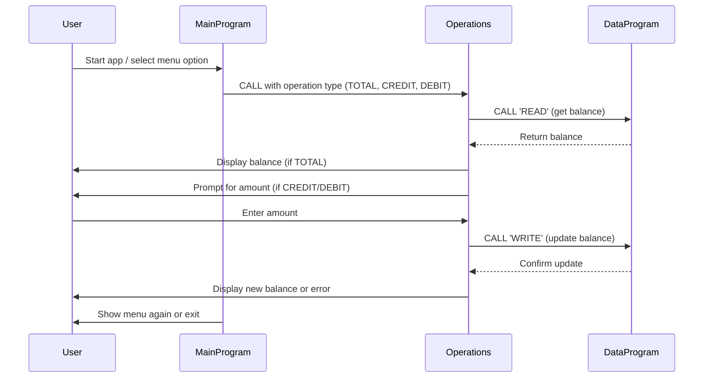

# COBOL Student Account Management System Documentation

This project contains COBOL programs for managing student accounts, including viewing balances, crediting, and debiting accounts. Below is an overview of each COBOL file, their key functions, and business rules.

## File Overview

### `main.cob`

**Purpose:**

- Acts as the main entry point for the Account Management System.
- Presents a menu to the user for account operations.
- Handles user input and delegates actions to the `Operations` program.

**Key Functions:**

- Displays menu options: View Balance, Credit Account, Debit Account, Exit.
- Accepts user choices and calls the appropriate operation.
- Loops until the user chooses to exit.

**Business Rules:**

- Only allows valid choices (1-4). Invalid choices prompt the user again.

---

### `operations.cob`

**Purpose:**

- Implements the logic for account operations: viewing balance, crediting, and debiting.
- Interacts with the `DataProgram` to read and update balances.

**Key Functions:**

- Receives operation type from `main.cob` (TOTAL, CREDIT, DEBIT).
- For 'TOTAL': Reads and displays the current balance.
- For 'CREDIT': Accepts an amount, adds it to the balance, and updates storage.
- For 'DEBIT': Accepts an amount, checks for sufficient funds, subtracts from balance if possible, and updates storage.

**Business Rules:**

- Credit and debit operations require user input for the amount.
- Debit operation checks for sufficient funds before proceeding; if insufficient, displays an error message.

---

### `data.cob`

**Purpose:**

- Handles persistent storage and retrieval of the account balance.
- Provides read and write operations for the balance.

**Key Functions:**

- For 'READ': Returns the current stored balance.
- For 'WRITE': Updates the stored balance with the new value.

**Business Rules:**

- Initial balance is set to 1000.00.
- Only updates balance when a valid write operation is requested.

---

## Business Rules Summary

- Student accounts start with a balance of 1000.00.
- Credit and debit operations update the balance accordingly.
- Debit operations are only allowed if sufficient funds are available.
- All operations are performed through a menu-driven interface.

---

For further details, refer to the source code in the `src/cobol/` directory.

---

## Sequence Diagram: Student Account Data Flow

